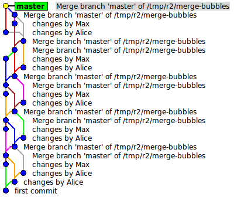
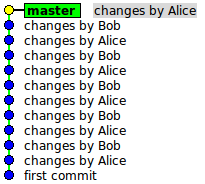

% Intermediate Git
% Jesse Keating and Adam Monsen
% October 11, 2013

# Intro

<!--
Conference: SeaGL 2013
Target audience: Git intermediate users

S5 keyboard controls quick reference:
* Jump directly to slide: Type slide number, then hit Return or Enter
* Switch between slideshow and outline view: t
(more at http://meyerweb.com/eric/tools/s5/features.html)
-->

<!-- Adam -->

- What we'll cover
    - collaboration with others
    - more advanced error recovery
    - bug forensics

# Credits

- Thank you, SCCC, thank you SeaGL, and thank you all the sponsors!

# It's a Mystery!

- Something's broken. Grab your Sherlock hat and pipe.
- `git bisect` ([demo repo](https://github.com/meonkeys/secret-octo-ironman))
    - binary search for commit introducing bug
- other helpful tools
  - `git blame`
  - continuous integration

<ol>
  <li>this bug is easy to fix, but hard to find when it entered the code</li>
  <li>could use blame to see who changed the offending line, and when</li>
  <li>CI would have found the bug right after it was committed</li>

# Collaboratification

- You've identified and fixed a problem. Now, get your fix upstream!

# Get familiar with GitHub

- GitHub at a glance
    - very popular, integrates with everything
    - lightning-fast collaboration
    - proprietary, but most data+history are in git
    - if you can use Git, you can use GitHub

# Central repo "workplace" example

- GitHub pull request demo
    - create branch
    - commit change
    - push change
    - create PR
    - merge PR
    - delete branch

<pre>
$ git checkout -b newtitle
$ editor README.md
$ git commit
$ git push -u origin newtitle
</pre>

This section used to be about creating a stand-alone bare clone to share
with others over SSH. This still works, of course, but you'll probably also
want to learn GitHub since so many people use it.

Warning: some data is not in saved your git repo. For instance: pull request
description/body, code reviews. It may be possible to export this.

# Spread the fix around

- Cherry picking
    - diff-and-apply from anywhere to anywhere
    - consider `-x`, as in `git cherry-pick -x COMMIT`

<ol>
    <li>commit something to a branch</li>
    <li>cherry-pick it onto another branch</li>
</ol>

- Merging, conflict resolution
    - software (including Git) doesn't help much
    - great communication does!

# Get Clever (1/3)

- We've spent weeks on this change. Meanwhile, upstream has marched on!
- time to integrate _locally_: `git merge` or `git rebase`
    - either works: it's a [matter of preference](http://arjanvandergaag.nl/blog/clarify-git-history-with-merge-commits.html)
    - let's rebase

# Aside: rebase vs. merge

# Get Clever (1.5/3)

- practical rebasing
    - `git rebase --interactive`
    - `git pull --rebase`
    - `git config branch.autosetupmerge always`

<ol>
  <li>Make a series of commits on a branch, some fixups, etc..</li>
  <li>Make more nonconflicting changes on master</li>
</ol>
<pre>
$ git rebase -i HEAD^^^
</pre>
<pre>
$ git rebase master
</pre>

- never rebase a shared branch!

# Get Clever (2/3)

- interactive commit
    - just like `add -p` followed by commit

Make some local modifications, then
<pre>
$ git commit --interactive
</pre>

- `git reflog`
    - recover lost commits

<pre>
# make changes
$ git commit -m 'first'
# make more changes
$ git commit -m 'second'
# whoops! blow away 'second'
$ git reset --hard HEAD^
# hooray, git still has it
$ git reflog
$ git reset --hard HEAD@{1}
</pre>

Note that <code>git merge HEAD@{1}</code> also works. Good luck with that one.

Further reading:
<ol>
  <li><a href="http://gitready.com/intermediate/2009/02/09/reflog-your-safety-net.html">http://gitready.com/intermediate/2009/02/09/reflog-your-safety-net.html</a></li>
  <li><a href="http://gitready.com/advanced/2009/01/17/restoring-lost-commits.html">http://gitready.com/advanced/2009/01/17/restoring-lost-commits.html</a></li>

- `git stash`
  - like a cheapy cheap branch

Make some local modifications, then
<pre>
$ git stash
# or
$ git stash save 'WIP almost cracked SHA-512'
$ git stash list
$ git stash show -p
$ git stash pop
# or
$ git stash drop
</pre>

# Get Clever (3/3)

- `git grep`
    - can grep working tree or other treeishs

- `git show`
    - See content from history or other branches

# Get Old School (1/2)

- Creating patches by hand
    - format-patch
    - `git diff`
    - `git send-email`
    - `git request-pull`

Here we will do some of the same things that we did with github, only we
will do them manually to show a bit more of what's going on, and to give you
an idea of how to operate outside of GitHub.

Create some more changes but don't commit.
<pre>
$ git diff &gt; foo.patch
</pre>
Now commit it (and more) and then use format-patch to get the patch(es)
<pre>
$ git format-patch HEAD^
$ git format-patch &lt;hash&gt;^
</pre>
Finally show how you can send email directly with many options
<pre>
$ git send-email --compose --to jkeating@j2solutions.net --subject "Stuff" HEAD^^
</pre>

Git request-pull allows you to create a summary of differences in your fork
of a project. Very similar to a GitHub pull-request.

<pre>
$ git request-pull origin/master jlk ansible
</pre>

# Get Old School (2/2)

- Applying patches
    - `git apply`
    - `git am`
    - signed-off-by
    - format-patch / am is better because context

Here is how we can process the patch set. This is also what GitHub is
doing, and again we'll see the details of what happens.

Applying someting created with (git) diff is git apply.

Applying something created with git format-patch is git am

signed-off-by can be used to add a layer of record keeping

format-patch is better as it includes more context than pure diff

# Further reading

- Fork this talk: <https://github.com/meonkeys/git-talk>
- Read [Pro Git](http://progit.org)! Now. Do it now.

- [set `core.autocrlf` appropriately!](http://help.github.com/line-endings/)
- [git reference manual](http://schacon.github.com/git/git.html) (man pages)
- [git-enhanced shell prompt and tab-completion](http://git-scm.com/book/en/Git-Basics-Tips-and-Tricks#Auto-Completion)
    - invaluable info included in prompt
- [Adam's Git config](https://github.com/meonkeys/dotfiles)
- [Interactive revert](http://stackoverflow.com/a/2383361/156060), [hand-edited commits](http://stackoverflow.com/a/2333917/156060)

<!--
vim: ft=markdown
-->
